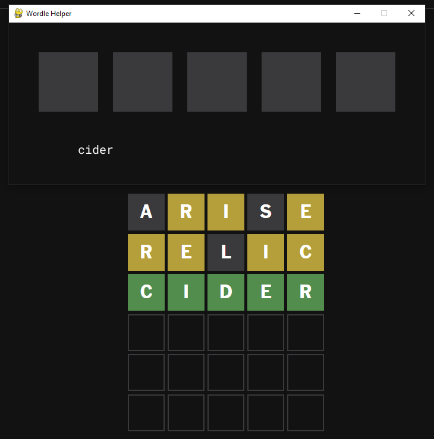
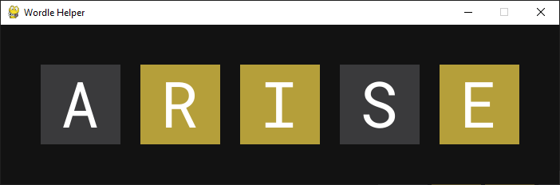
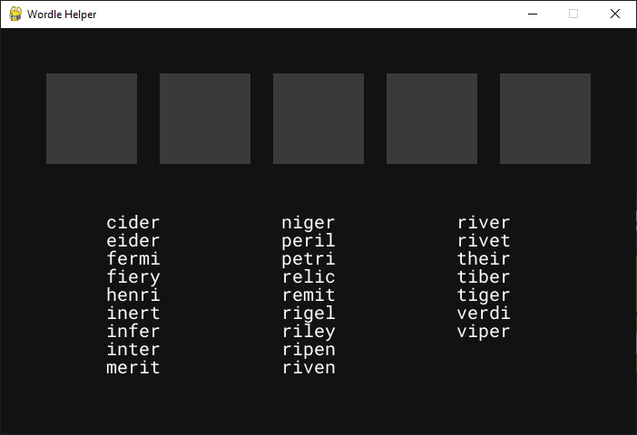

# Wordle Helper
(This is a small program after I finished my first year at College for fun, most recent project is YouTube Downloader)

This program uses a dictionary of 5-letter words to guide you through a game of Wordle. Input the word and the corresponding colors from Wordle to filter the dictionary and display the possible words.

Enter the word and click on each letter to rotate the colors. Set the colors to match those displayed in Wordle, then press "Enter". The program will filter the words and display the results accordingly.

Keep this process as the Wordle game continue to keep filtering the words.

